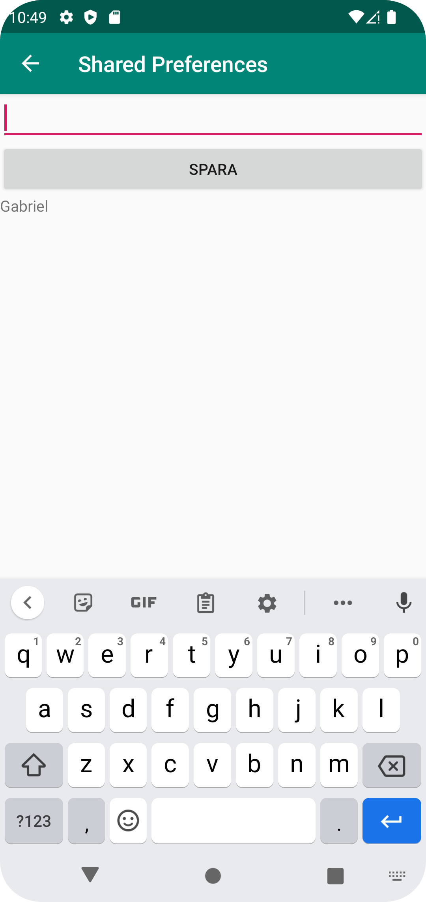

# Rapport
Skapade en ny screen (skärm) som kallas SecondActivity som skulle kunna öppnas från den första skärmen genom en knapp
(MainActivity). Lade även till en TextView i den första skärmens layout (xml) som skulle ta emot det 
det skickade värdet från den andra skärmen och sparade det när andra skärmen stängdes. 
I den andra skärmen lades en EditText för att skriva in data, knapp för att spara data samtidigt skicka datan till den 
första skärmen och en TextView för att se om data har sparats och uppdaterats. 


```
MainActivity
private SharedPreferences myPreferenceRef;
private SharedPreferences.Editor myPreferenceEditor;
@Override
    protected void onCreate(...) {
        ...

        Button minBtn = findViewById(R.id.prefButtons);

        minBtn.setOnClickListener(new View.OnClickListener() {
            @Override
            public void onClick(View view) {
                Log.d("==>", "Knappen fungerar!");
                Intent intent = new Intent(MainActivity.this, SecondActivity.class);
                startActivity(intent);
            }
        });
    }
    
    @Override
    protected void onResume (){
        super.onResume();

        myPreferenceRef = getSharedPreferences("MyPreferenceName", MODE_PRIVATE);
        myPreferenceEditor = myPreferenceRef.edit();

        // Display preferences
        TextView prefTextRef=new TextView(this);
        Log.d("Injera1", "" + myPreferenceRef.getString("MyAppPreferenceString", "No preference found."));
        prefTextRef=(TextView)findViewById(R.id.prefText);
        prefTextRef.setText(myPreferenceRef.getString("MyAppPreferenceString", "No preference found."));
    }
    
SecondActivity

    private SharedPreferences myPreferenceRef;
    private SharedPreferences.Editor myPreferenceEditor;
    
    @Override
    protected void onCreate(Bundle savedInstanceState) {
        super.onCreate(savedInstanceState);
        setContentView(R.layout.secondactivity_main);

        myPreferenceRef = getSharedPreferences("MyPreferenceName",MODE_PRIVATE);
        myPreferenceEditor = myPreferenceRef.edit();

        TextView prefTextRef=new TextView(this);
        prefTextRef=(TextView)findViewById(R.id.prefText);
        prefTextRef.setText(myPreferenceRef.getString("MyAppPreferenceString", "No preference found."));
    }

    public void savePref(View v){
        // Get the text
        EditText newPrefText=new EditText(this);
        newPrefText=(EditText)findViewById(R.id.settingseditview);

        // Store the new preference
        myPreferenceEditor.putString("MyAppPreferenceString", newPrefText.getText().toString());
        myPreferenceEditor.apply();

        // Display the new preference
        TextView prefTextRef=new TextView(this);
        prefTextRef=(TextView)findViewById(R.id.prefText);
        prefTextRef.setText(myPreferenceRef.getString("MyAppPreferenceString", "No preference found."));

        // Clear the EditText
        newPrefText.setText("");
    }
    
```




